

  <a href="arts-concept/ui/name.png">
    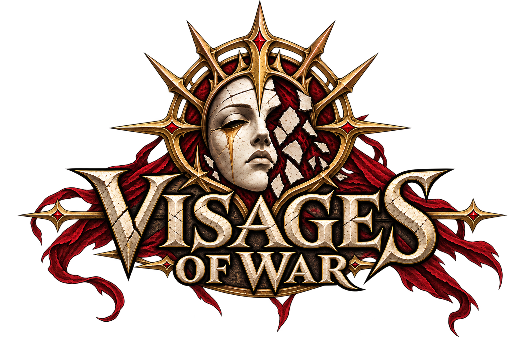
  </a>

# Visages of War

A story-driven RTS set in an original dark fantasy universe, featuring a campaign and PvE missions with unique commanders. Inspired by **Warcraft III** and **StarCraft II's co-op mode**.

**Windows PC · 2D real-time strategy · Early prototype**

[Concept gallery](#concept-art) · [Technical guide](README_TECHNICAL.md)

## The vision

Build a base, gather crystals, lead an army, and follow the people whose wars shape the world. Visages of War brings together classic RTS battles, hero progression, and missions built around a story.

Valeri is at the heart of that story. The Church, the Inquisition, the Dragon Empire, and the Plague are its central powers, each with a distinct identity and a place in the campaign.

- **A campaign at the heart of the game.** Authored missions with their own objectives, encounters, and place in the wider narrative.
- **Commanders with distinct identities.** Each commander is intended to bring a different army, mechanics, and approach to battle.
- **Heroes within your army.** Experience and levels, with abilities, passive effects, auras, and equipment planned as the project grows.
- **Terrain that matters.** Elevation, narrow passages, forests, water, and fog of war shape movement and visibility. A day/night cycle provides a foundation for future mechanics.
- **A world built in Visages Forge.** A dedicated map editor for terrain, texture painting, scenery, and unit placement.

## Concept art

A glimpse of Valeri and the central powers of the story. These are concept artworks, not screenshots of the current game. Click an image to view it in full.

  <a href="arts-concept/inquisition/valeri.png">
    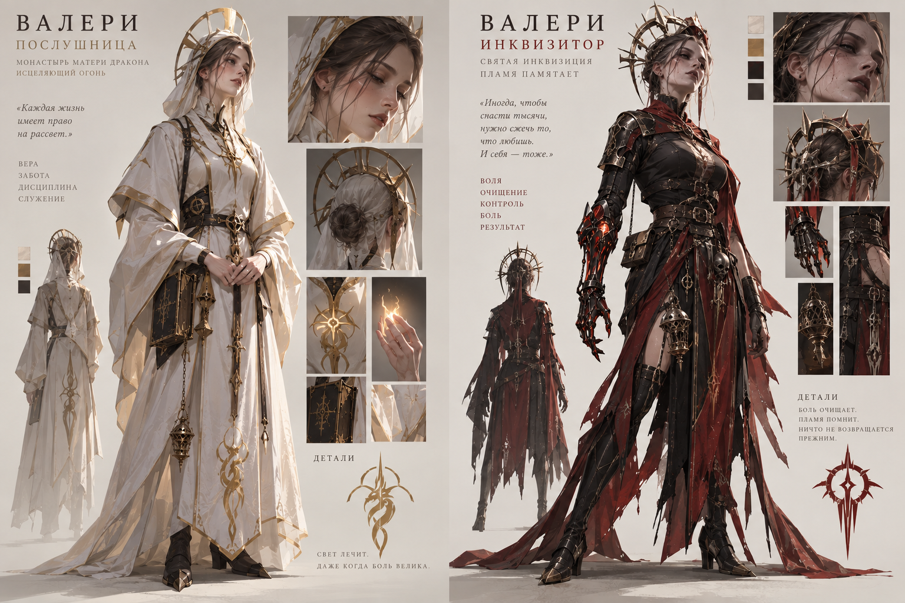
  </a> 
  <strong>Valeri</strong> From novice to inquisitor

### The Church of the Dragon Mother

White and gold, sacred fire, and a faith centred on healing and protection.

<table>
  <tr>
    <td align="center" width="33%">
      <a href="arts-concept/holy-dragon/paladin.png">
        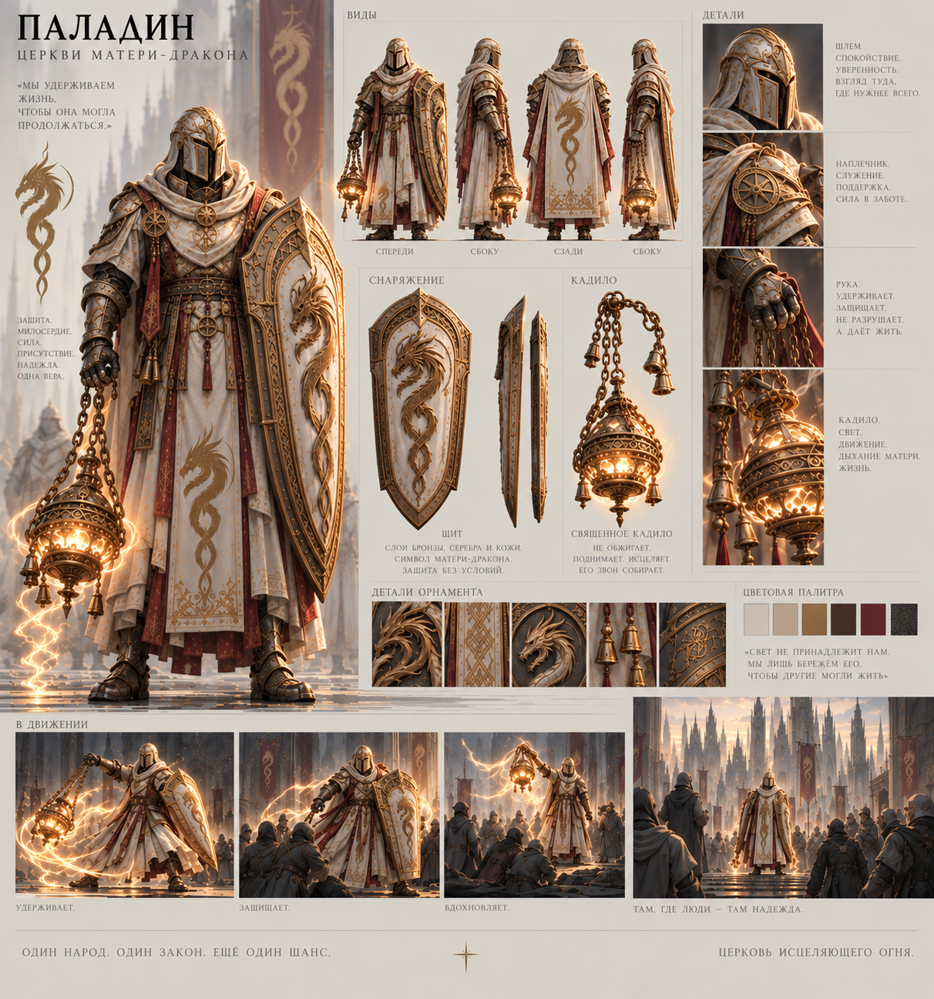
      </a> 
      <strong>Paladin</strong>
    </td>
    <td align="center" width="33%">
      <a href="arts-concept/holy-dragon/priestess.png">
        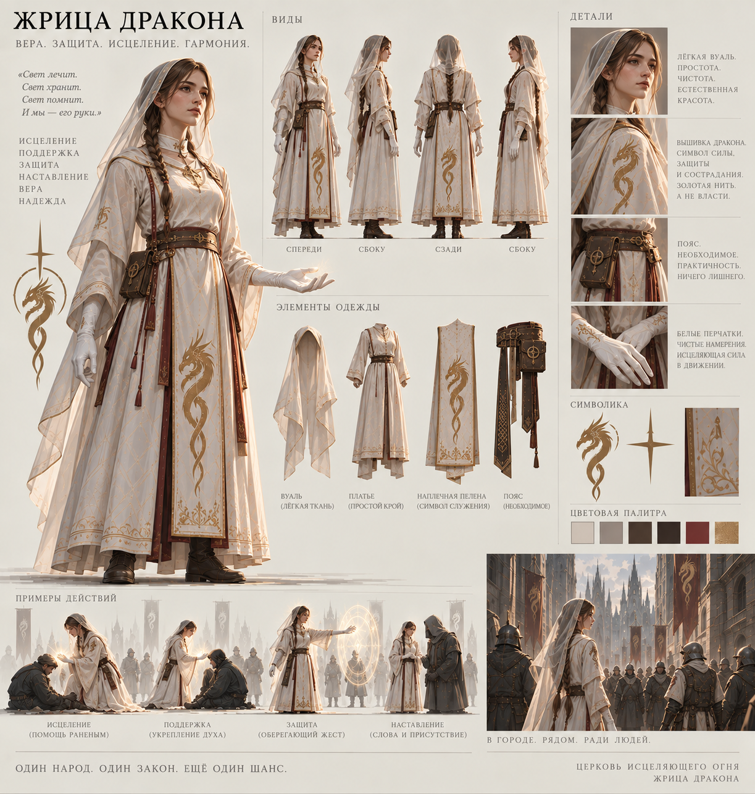
      </a> 
      <strong>Dragon Priestess</strong>
    </td>
    <td align="center" width="33%">
      <a href="arts-concept/holy-dragon/chram-materi-dragon.png">
        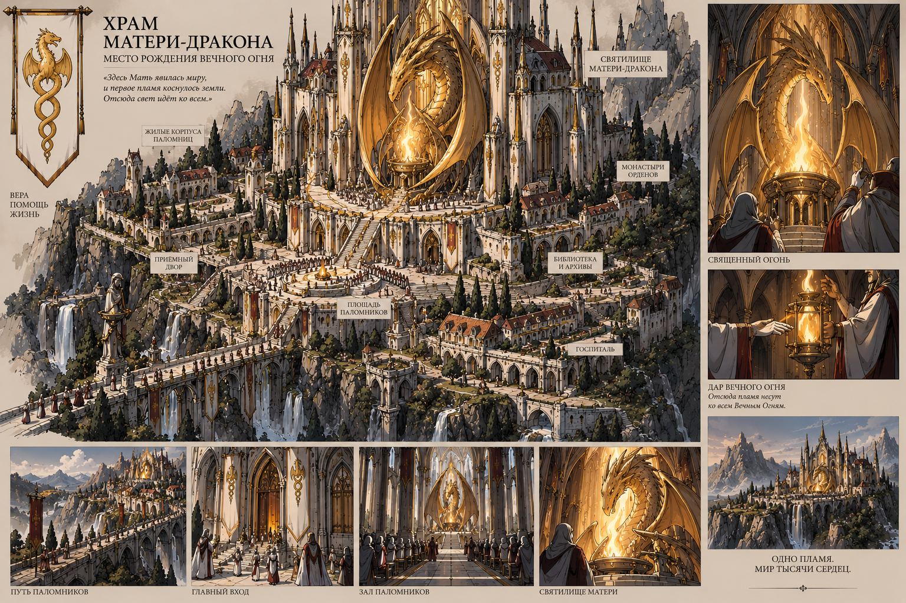
      </a> 
      <strong>Temple of the Dragon Mother</strong>
    </td>
  </tr>
</table>

[More Church concepts](arts-concept/holy-dragon/).

### The Inquisition

Crimson robes, iron masks, ash, and the machinery of purification.

<table>
  <tr>
    <td align="center" width="33%">
      <a href="arts-concept/inquisition/ash-lady.png">
        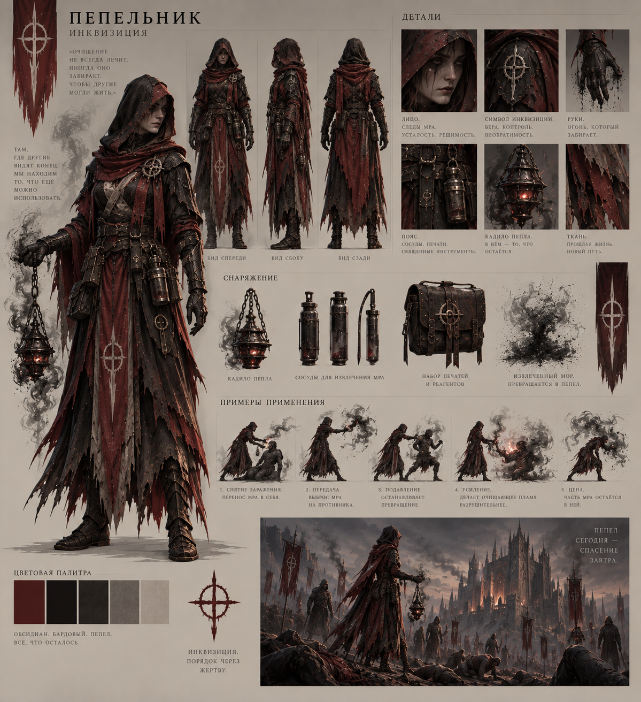
      </a> 
      <strong>Ash and Purification</strong>
    </td>
    <td align="center" width="33%">
      <a href="arts-concept/inquisition/judge.png">
        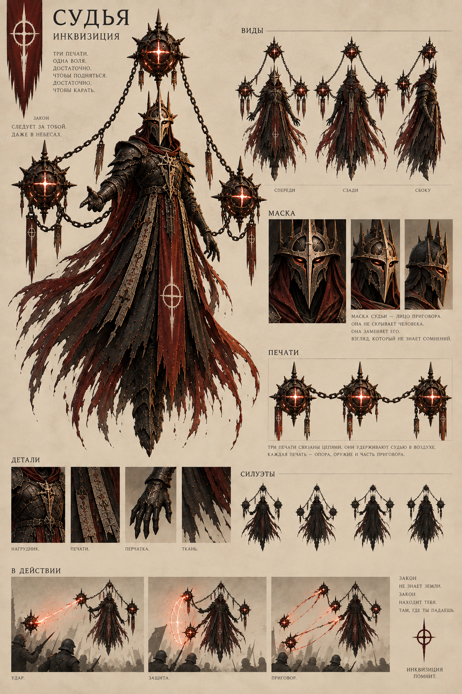
      </a> 
      <strong>Judge</strong>
    </td>
    <td align="center" width="33%">
      <a href="arts-concept/inquisition/purification-wagon.png">
        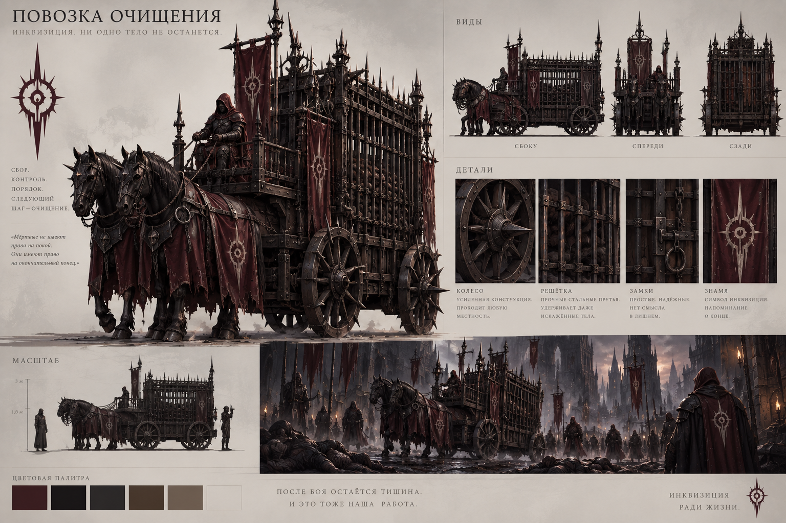
      </a> 
      <strong>Purification Wagon</strong>
    </td>
  </tr>
</table>

[More Inquisition concepts](arts-concept/inquisition/).

### The Dragon Empire

Imperial banners, disciplined soldiers, and the bond between human and dragon forms.

<table>
  <tr>
    <td align="center" width="33%">
      <a href="arts-concept/dragon/serafina.png">
        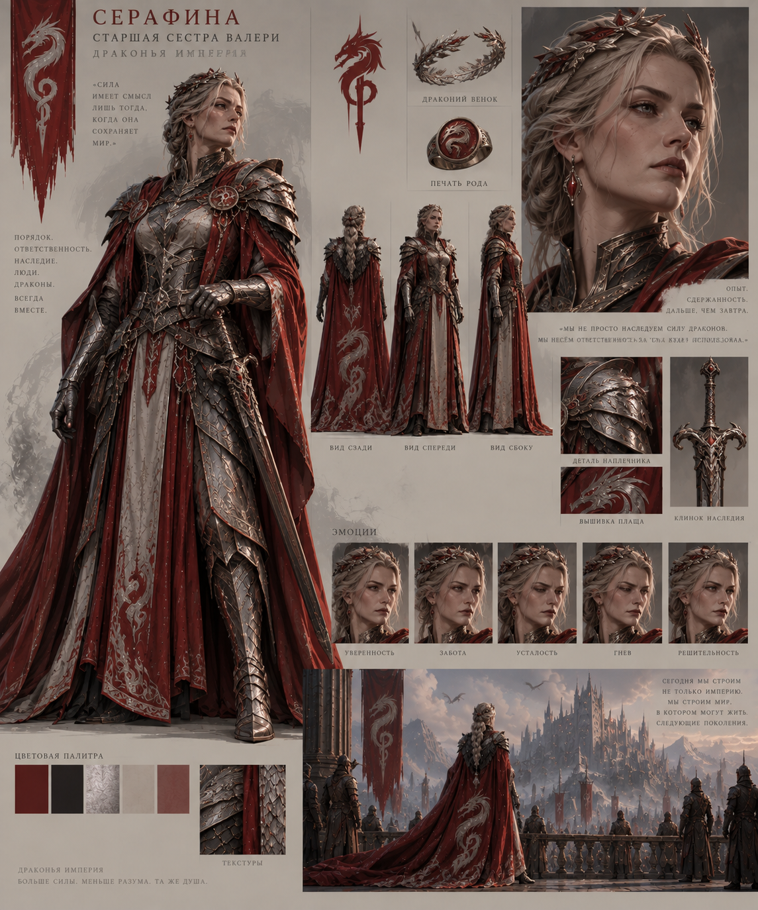
      </a> 
      <strong>Serafina</strong>
    </td>
    <td align="center" width="33%">
      <a href="arts-concept/dragon/dragon-slayer.png">
        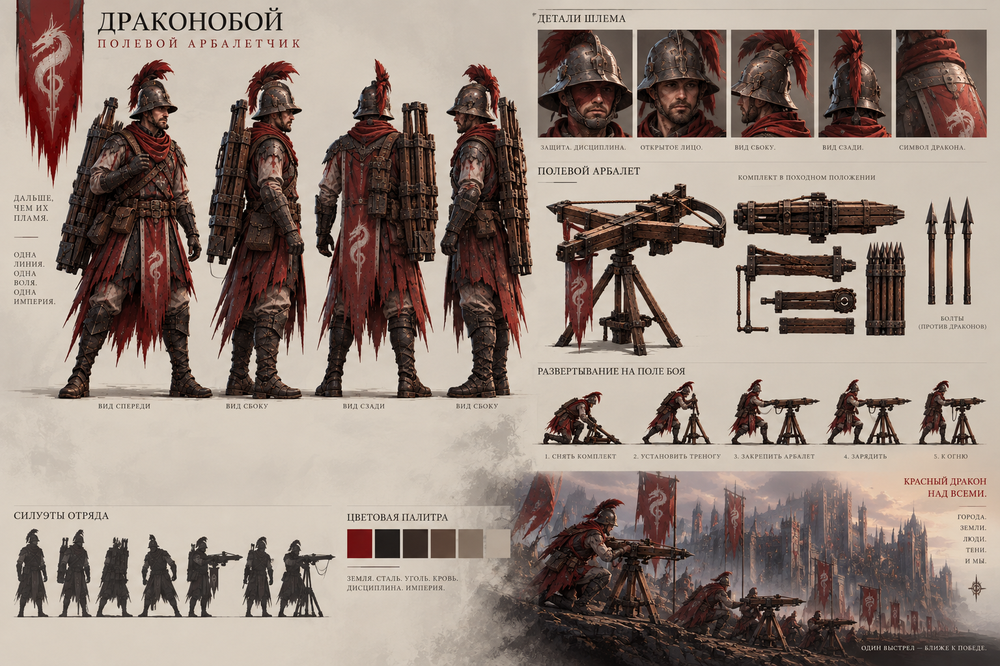
      </a> 
      <strong>Dragon Slayer</strong>
    </td>
    <td align="center" width="33%">
      <a href="arts-concept/dragon/drakonid-1.png">
        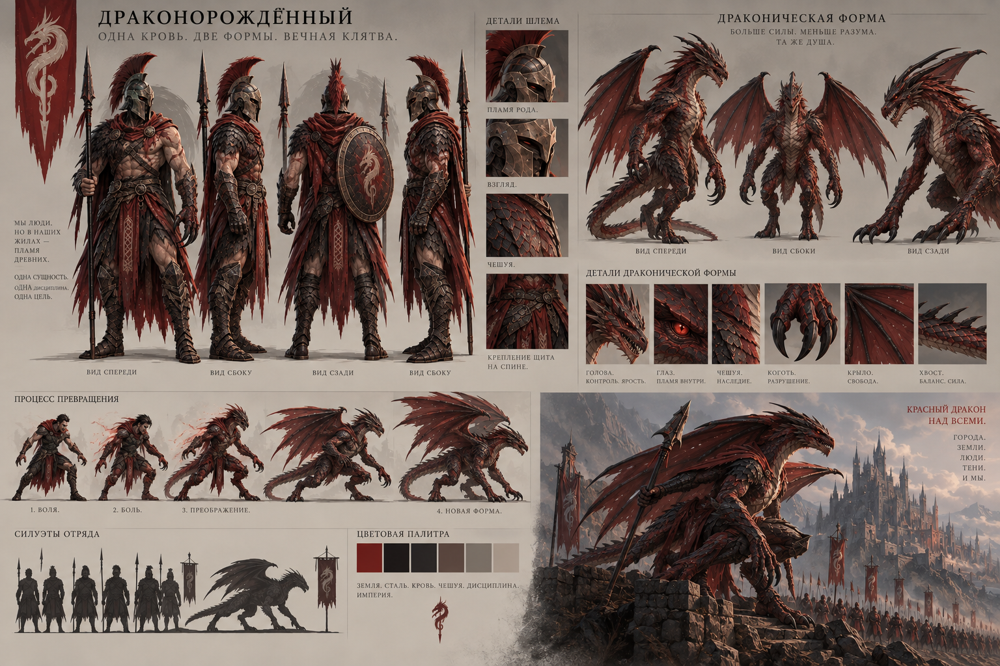
      </a> 
      <strong>Dragonborn</strong>
    </td>
  </tr>
</table>

[More Dragon Empire concepts](arts-concept/dragon/).

### The Plague

Stitched bodies, bound souls, and structures of bone, iron, and cloth.

<table>
  <tr>
    <td align="center" width="33%">
      <a href="arts-concept/mor/plague.png">
        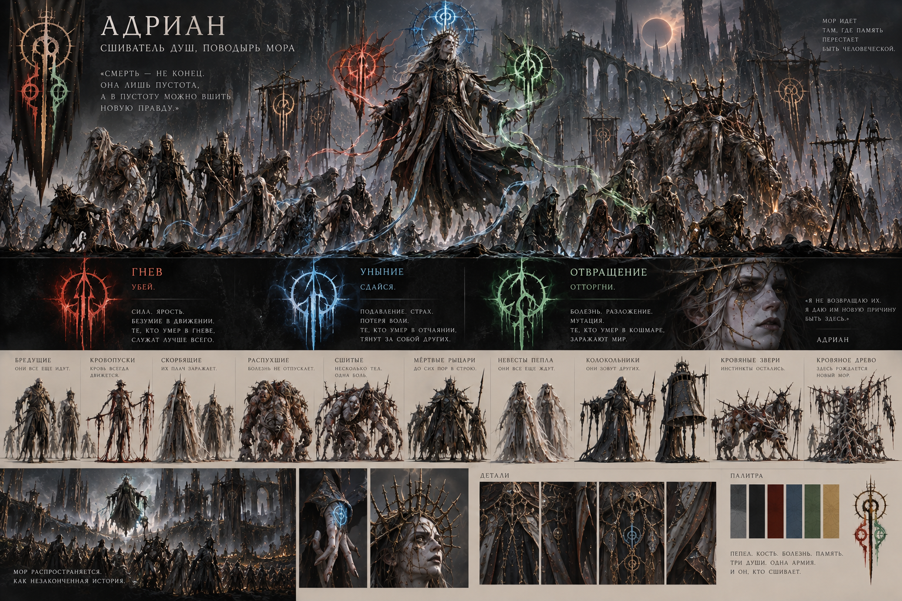
      </a> 
      <strong>Adrian and His Army</strong>
    </td>
    <td align="center" width="33%">
      <a href="arts-concept/mor/mor-kuklovod.png">
        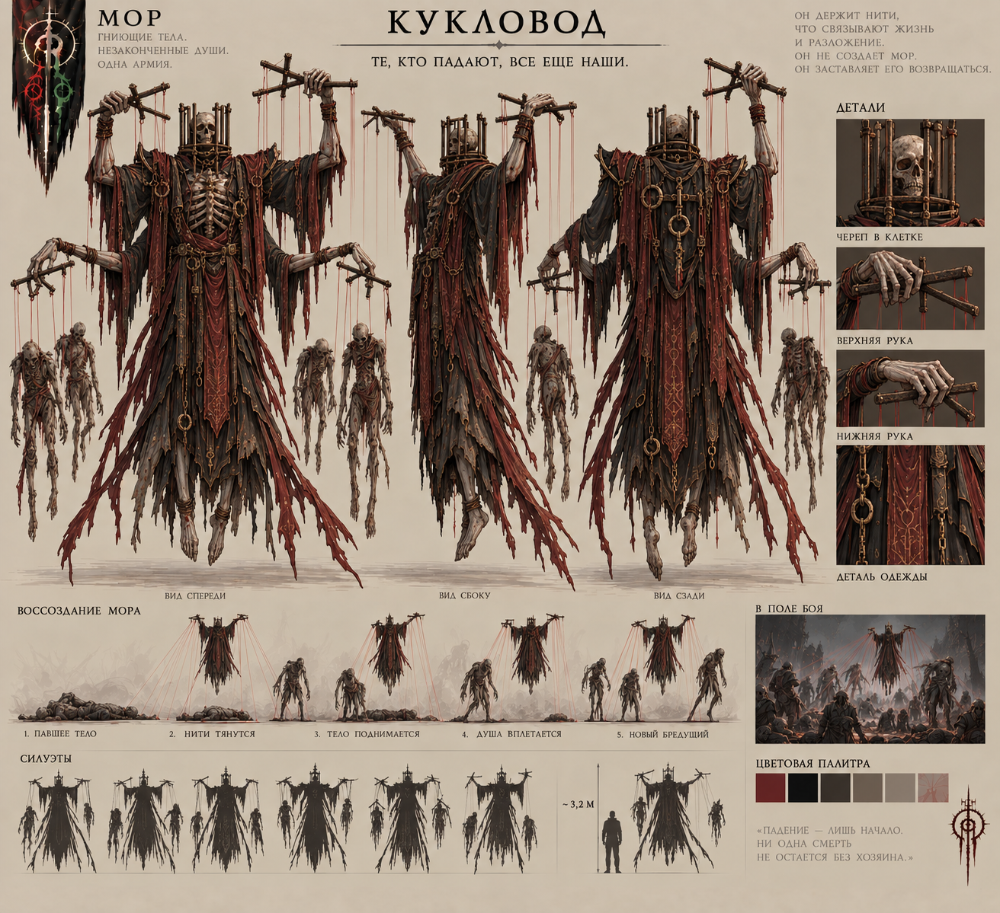
      </a> 
      <strong>Puppeteer</strong>
    </td>
    <td align="center" width="33%">
      <a href="arts-concept/mor/mor-buildings.png">
        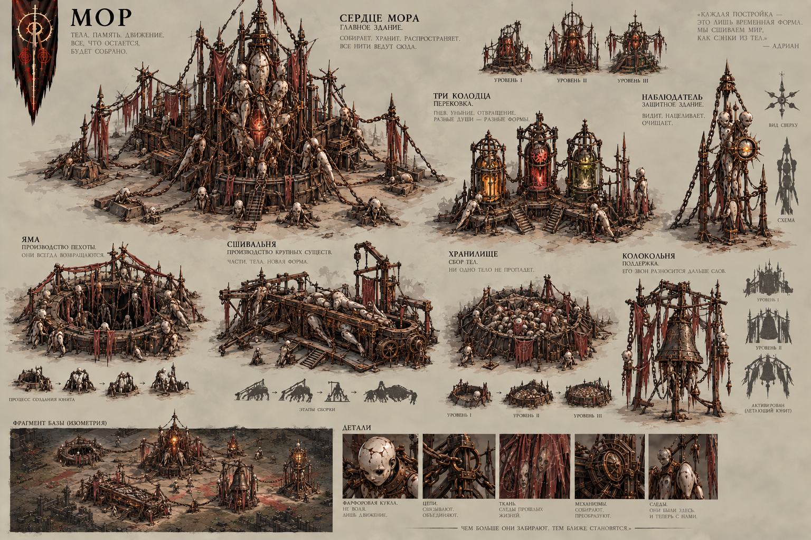
      </a> 
      <strong>Architecture of the Plague</strong>
    </td>
  </tr>
</table>

[More Plague concepts](arts-concept/mor/).

## Where the project is today

Visages of War is an early prototype built on a custom C++ engine. The current test battlefield supports crystal gathering, construction and training, group formations, melee and ranged combat, flying units, hero experience, terrain elevation, and fog of war. Visages Forge runs as a separate application and can save maps and launch them in the game.

The campaign and full commander rosters are still ahead. Much of the in-game artwork is temporary; the concepts above show the intended visual direction.

Peacemakers replace the former ground soldiers on the demo map and in barracks production. Their eight sprite facings are synthesized from two drawn views, with stand, walk and attack animations; cardinal facings are approximate warps. The aligned sheet uses 512×512 cells and authored team-colour masks for the unit, death sequence, icon and portrait. A shared four-frame death animation holds its final frame as a corpse. All unit corpses last 60 simulation seconds and never block movement. Flyers temporarily use archer artwork. All units share a lower-third cell anchor for rendering and picking, while simulation coordinates stay unchanged. See [the sprite experiment](docs/ASSETS.md#peacemaker-two-direction-prototype).

For setup, build instructions, controls, architecture, and the exact scope of the prototype, see the **[technical README](README_TECHNICAL.md)** (in Russian).
